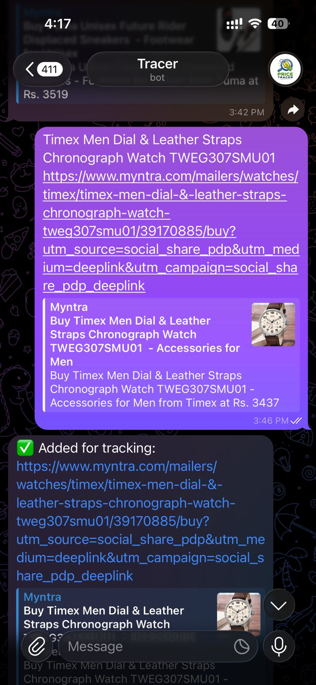
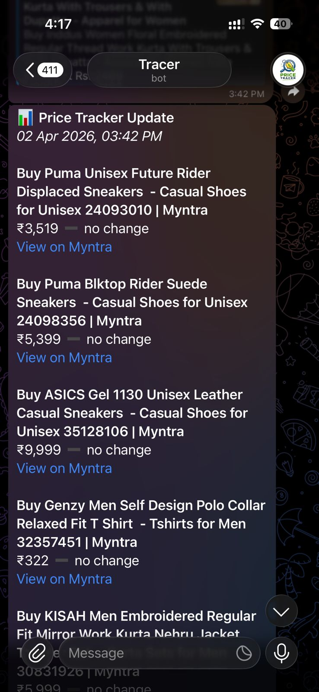

# Online Shopping Price Tracer

A Python-based price tracking tool for Myntra products (support for other ecom. sites in progress) with Telegram bot integration and automated daily checks using cron jobs.

## Why This Project

I needed a new sneakers yesterday, but soon realised that most of the shoes that i like had their prices increased and i missed a lot of sales/ price drops in last few months.
So needed a way to keep track of their prices regularly, once price is dropped, i can hopefully buy them. Manually checking product pages every day is tedious and easy to forget.
This project automates that, one not need to go to each myntra page and see the prices anymore.

## What It Does

- **Scrapes product prices** from Myntra using multiple extraction strategies (structured JSON-LD, embedded `pdpData`, regex fallback) to reliably pull MRP, selling price, and discount percentage.
- **Tracks price history** across runs in a local `price_history.json` file, detecting price drops, increases, or no change compared to the last recorded price.
- **Sends Telegram notifications** with a summary of all tracked products, highlighting price drops and new additions.
- **Accepts new products via Telegram** — send a Myntra URL to the bot and it automatically adds it to the tracking list.
- **Runs daily Using CRON jobs** (9:00 AM IST) using a scheduled cron workflow, committing updated price history back to the repo.
- **Supports manual runs** — pass a single URL as a CLI argument or populate `products_to_track.txt` with multiple URLs.

### Usage

```bash
# Track a single product
python price_tracer.py <myntra-product-url>

# Track all products in products_to_track.txt
python price_tracer.py

# Get your Telegram chat ID
python price_tracer.py --chat-id

# Check for new URLs sent to the Telegram bot
python price_tracer.py --check-messages
```

Set the `TELEGRAM_BOT_TOKEN` environment variable to enable Telegram notifications.

## Demo

https://github.com/Ayush909/claude-experiments/raw/main/demos/tracer.mp4

## Screenshots





## Limitations

- Scripts are running using CRON jobs on my continuously running laptop, if it closes, scripts won't run. One solution is to buy a VPS and run my scripts there, but the cost attached doesn't justify the scale of this project currently.
- Scraping the myntra url is blocked by myntra if done from an external source like github actions, CORS errors, etc. It works on my laptop since its a residential IP.
- Currently handles only myntra URLs
- Adding a new url for tracking via Telegram bot doesn't add the new product instantly, it adds only when the next cron job is scheduled for.
